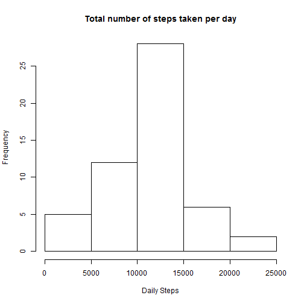
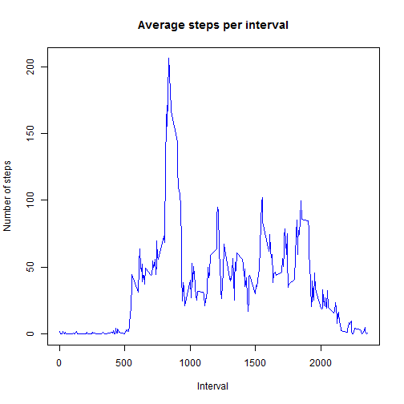
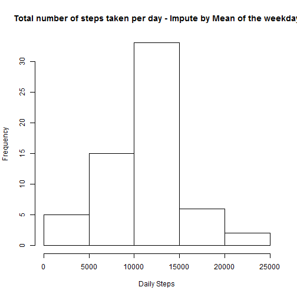
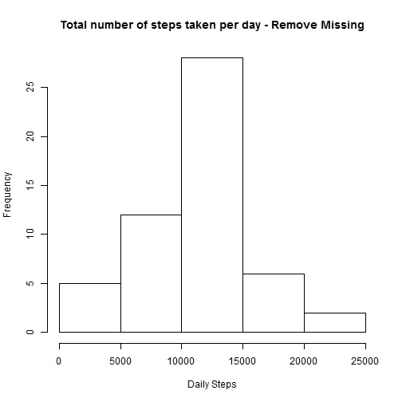
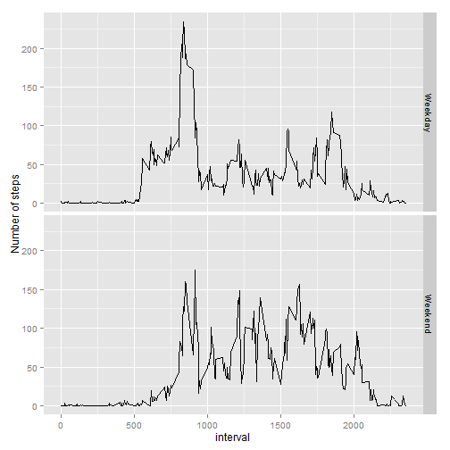

## Loading and preprocessing the data


```r
  library(plyr)
  library(dplyr)
```

```
## 
## Attaching package: 'dplyr'
## 
## The following objects are masked from 'package:plyr':
## 
##     arrange, count, desc, failwith, id, mutate, rename, summarise,
##     summarize
## 
## The following object is masked from 'package:stats':
## 
##     filter
## 
## The following objects are masked from 'package:base':
## 
##     intersect, setdiff, setequal, union
```

```r
  library(lubridate)
```

```
## 
## Attaching package: 'lubridate'
## 
## The following object is masked from 'package:plyr':
## 
##     here
```

```r
  library(ggplot2)

  activity <- read.csv("activity.csv")
  activity$date <- as.Date( activity$date )
  activity_valid <- subset(activity, !is.na(steps))
  
  activity_group <- group_by(activity_valid, date)
  activity_daily <- summarize(activity_group, steps_daily = sum(steps) )
```

## What is mean total number of steps taken per day?
Finding mean and median and plotting histogram from for the daily steps


```r
   daily_mean <- round(mean(activity_daily$steps_daily))
   daily_mean
```

```
## [1] 10766
```

```r
   daily_median <- round(median(activity_daily$steps_daily))
   daily_median
```

```
## [1] 10765
```

```r
   ##Histogram for the daily steps
   hist(activity_daily$steps_daily, main = "Total number of steps taken per day", xlab="Daily Steps")
```

 

## What is the average daily activity pattern?

```r
  activity_group <- group_by(activity_valid, interval)
  activity_interval <- summarize(activity_group, steps_avg = mean(steps) )

  plot(x=activity_interval$interval, y=activity_interval$steps_avg, type="l", xlab="Interval", ylab="Number of steps", main="Average steps per interval", col = "Blue" )
```

 

```r
  ##The 5-minute interval, on average across all the days in the dataset, contains the maximum number of steps
  activity_interval[activity_interval$steps_avg==max(activity_interval$steps_avg),1]
```

```
## Source: local data frame [1 x 1]
## 
##   interval
## 1      835
```

## Imputing missing values
Calculating the number of missing steps

```r
  missing <- is.na(activity$steps)
## No of missing steps  
  sum(missing)
```

```
## [1] 2304
```

```r
 ## Impute the missing steps with mean of the same weekday for the respective intervals

  activity_valid$wday <- wday(activity_valid$date)
  activity_group <- group_by(activity_valid, interval, wday)
  activity_wday <- summarize(activity_group, average_steps = mean(steps) )
  
  activity$wday <- wday(activity$date)

  activity_impute <- join(activity, activity_wday, type="inner" )
```

```
## Joining by: interval, wday
```

```r
  activity_impute[is.na(activity_impute$steps) ,1] <- activity_impute[is.na(activity_impute$steps) ,5]

  activity_group <- group_by(activity_impute, date)
  activity_impute_summary <- summarize(activity_group, steps_daily = sum(steps) )

  
  impute_mean <- round(mean(activity_impute_summary$steps_daily))
  impute_mean
```

```
## [1] 10821
```

```r
  impute_median <- round(median(activity_impute_summary$steps_daily))
  impute_median
```

```
## [1] 11015
```

```r
   ##Histogram for the daily steps
  hist(activity_impute_summary$steps_daily, main = "Total number of steps taken per day - Impute by Mean of the weekday", xlab="Daily Steps")    
```

 

```r
  hist(activity_daily$steps_daily, main = "Total number of steps taken per day - Remove Missing", xlab="Daily Steps")   
```

 

After imputing the missing steps with mean of the same weekday for the respective intervals, the mean increased to 10821 from 10766 and the median increased to 11015 from 10765


## Are there differences in activity patterns between weekdays and weekends?

```r
  activity_valid$weekdays <- ifelse(wday(activity_valid$date) == 1 | wday(activity_valid$date) == 7, "Weekend", "Weekday"     ) 
  
  activity_group <- group_by(activity_valid, interval, weekdays)
  activity_weekly <- summarize(activity_group, average_steps = mean(steps) )

 qplot(interval,average_steps, data=activity_weekly ,geom="line", binwidth =2) + facet_grid(weekdays ~ . )+ labs(y = "Number of steps")
```

 
